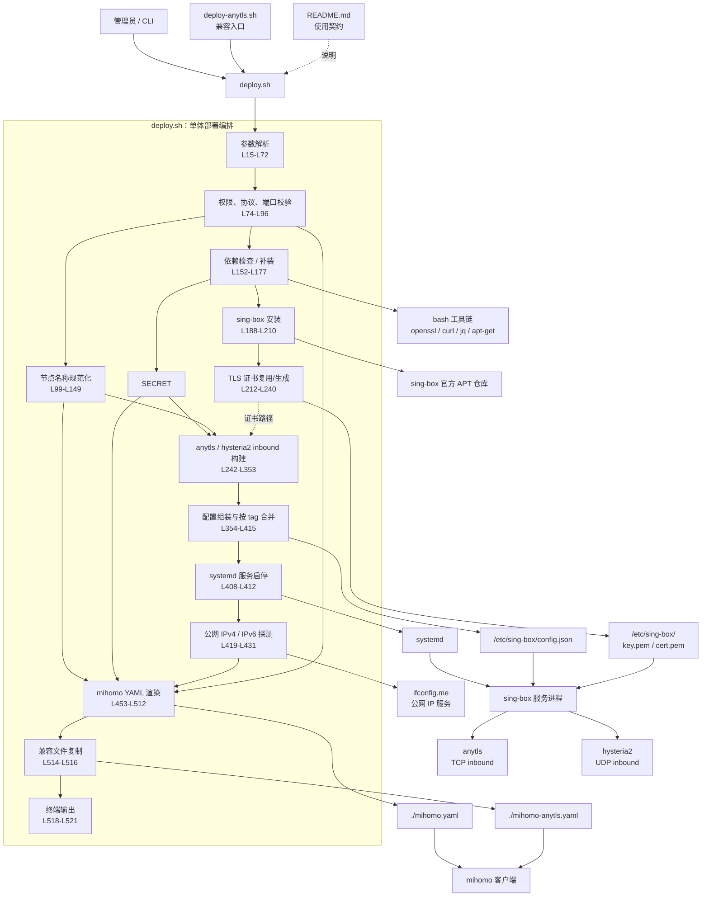

# 项目架构

## 扫描结论

项目是一个**脚本式单体部署工具**，没有 Go、Node.js、Python 等内部业务包。核心逻辑全部集中在 `deploy.sh`，`deploy-anytls.sh` 只是兼容入口。

## 项目结构

```text
项目
├── deploy.sh              核心部署编排脚本
├── deploy-anytls.sh       旧入口兼容包装器
├── test_deploy.sh         CLI 回归检查
├── README.md              使用说明与行为契约
└── .gitignore             仓库元数据
```

## 模块依赖图

> 图中的“模块”是 `deploy.sh` 内部的逻辑分区，不是独立文件或包。



## 主要依赖关系

| 模块 | 主要依赖 | 产出 |
|---|---|---|
| `deploy-anytls.sh` | `bash`、`deploy.sh` | 转发全部参数 |
| 参数与校验 | Bash 内建能力 | `PORT`、`HY2_PORT`、协议开关等 |
| 名称规范化 | `hostname`、`tr`、`awk`、`sed`、`xargs` | 节点基础名称 |
| 依赖检查 | `openssl`、`curl`、`jq`、`apt-get` | 补齐运行环境 |
| sing-box 安装 | `curl`、APT、sing-box 官方仓库 | sing-box 软件包 |
| 证书复用/生成 | `openssl` | `/etc/sing-box/key.pem`、`cert.pem` |
| 配置生成与合并 | `jq` | `/etc/sing-box/config.json` |
| 服务管理 | `systemctl` | 启动/重启 sing-box |
| 公网 IP 探测 | `curl`、`ifconfig.me` | 公网 IPv4/IPv6 |
| Mihomo 输出 | Bash 重定向、`cp` | `mihomo.yaml`、兼容文件 |

## 实际运行链路

```text
CLI 参数
  ↓
deploy.sh
  ↓
校验端口与启用协议
  ↓
检查/安装 openssl、curl、jq、sing-box
  ↓
复用或生成共享自签名证书
  ↓
构建 anytls-in / hy2-in
  ↓
按 tag 合并或写入 sing-box 配置
  ↓
systemctl 重启 sing-box
  ↓
检测公网 IPv4 / IPv6
  ↓
生成 mihomo.yaml
```

## 状态与数据流

- **系统配置状态**：`/etc/sing-box/config.json`
- **TLS 密钥材料**：`/etc/sing-box/key.pem`、`/etc/sing-box/cert.pem`
- **证书更新策略**：重复部署默认复用已有证书，使用 `--renew-cert` 才会重新生成
- **服务状态**：systemd 管理的 `sing-box`
- **客户端配置产物**：当前目录的 `mihomo.yaml`
- **兼容产物**：当前目录的 `mihomo-anytls.yaml`
- **默认协议关系**：anytls 使用 TCP，hysteria2 使用 UDP，默认共享端口号
- **IP 探测失败策略**：IPv4/IPv6 均不可用时使用 `unknown` 并输出警告
- **配置更新策略**：已有 `config.json` 时，仅替换 `anytls-in` 与 `hy2-in` 两个 tag，保留其他 inbound

## 架构特征

1. **入口简单**：新用户使用 `deploy.sh`，旧用户通过 `deploy-anytls.sh` 转发到新入口。
2. **核心高度集中**：参数解析、依赖安装、证书复用/生成、配置写入、服务管理和客户端配置生成均位于同一个脚本。
3. **外部系统耦合明确**：脚本直接操作 APT、`/etc/sing-box`、systemd，并访问 sing-box 官方仓库和 `ifconfig.me`。
4. **无内部包级依赖图**：当前仓库的依赖关系主要是脚本调用、Shell 命令调用和系统资源读写，而不是类库或服务之间的 import 关系。
5. **幂等更新集中在配置阶段**：通过 inbound tag 过滤实现重复部署时的局部替换。

## 证据位置

| 内容 | 文件位置 |
|---|---|
| 兼容入口 | `deploy-anytls.sh:1-8` |
| 参数解析与校验 | `deploy.sh:15-96` |
| 节点名称规范化 | `deploy.sh:99-149` |
| 依赖检查与密码生成 | `deploy.sh:152-185` |
| sing-box 安装 | `deploy.sh:188-210` |
| TLS 证书复用/生成 | `deploy.sh:212-240` |
| inbound 构建与配置合并 | `deploy.sh:242-415` |
| 服务启动与公网 IP 探测 | `deploy.sh:408-431` |
| Mihomo 配置输出 | `deploy.sh:453-521` |

> 本文基于当前 Git 跟踪的项目文件扫描生成；部署逻辑以 `deploy.sh` 当前实现为准。
